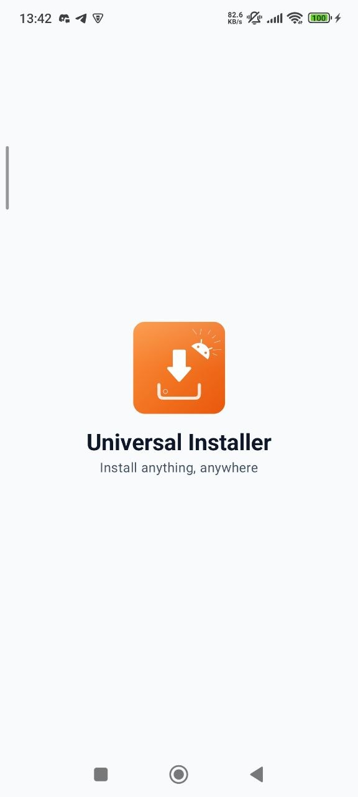
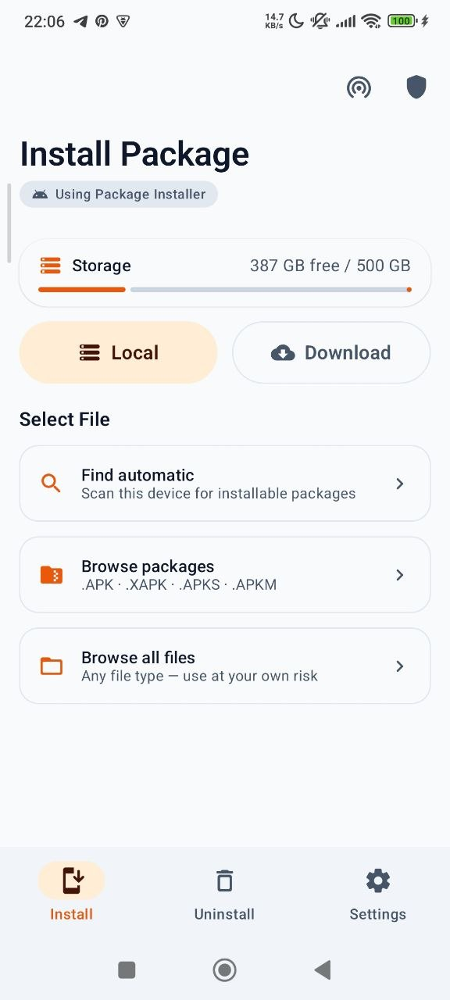
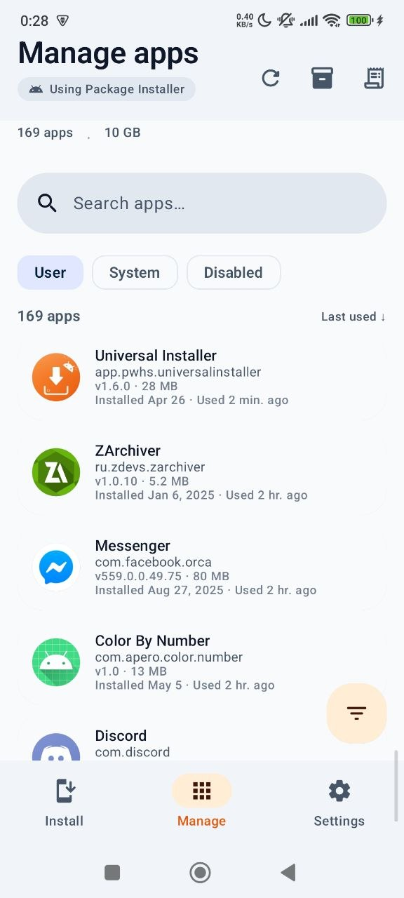
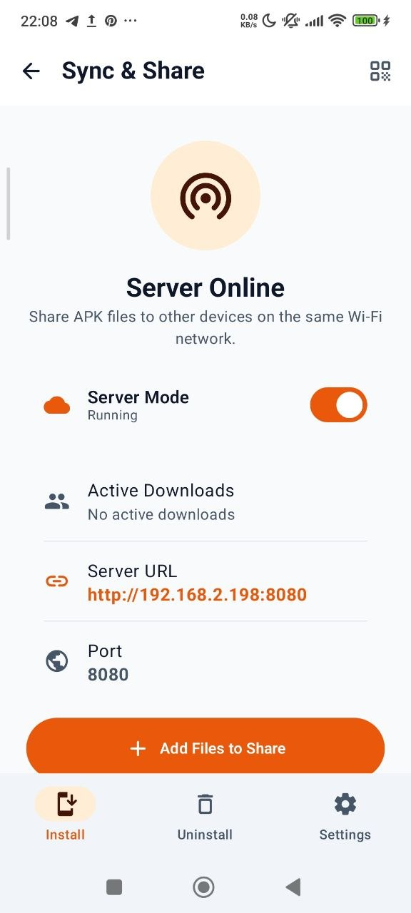

<div align="center">
  
  <h1>Universal Installer</h1>
  <p><strong>Universal Installer</strong> is a modern Android package manager that handles what the default installer can't.</p>
  <p>Install <strong>APK, APKS, XAPK, and APKM</strong> files with split APK support, silent installs via Shizuku, and VirusTotal malware scanning.</p>
  <br><br>
  <a href="https://github.com/pass-with-high-score/universal-installer/releases">
    
  </a>
  <a href="https://github.com/pass-with-high-score/universal-installer/releases">
    
  </a>
  <br><br>
  <h4>Download</h4>
  <a href="https://play.google.com/store/apps/details?id=com.apero.universal.installer">
    
  </a>
  <a href="https://github.com/pass-with-high-score/universal-installer/releases">
    
  </a>
</div>

---

## Screenshots

<div align="center">
  
  
  
  
</div>

---

## Features

* **Multi-format support** — Install `.apk`, `.apks`, `.xapk`, `.apkm` files
* **APK analysis** — Preview app name, icon, version, permissions, supported ABIs, languages, and min SDK before installing
* **Split APK handling** — Powered by [Ackpine](https://ackpine.solrudev.ru/) for reliable split package installation
* **Shizuku silent install** — Install/uninstall apps without confirmation prompts (requires [Shizuku](https://shizuku.rikka.app/))
* **VirusTotal scanning** — Automatically scan APKs for malware before installation using the VirusTotal API
* **Installation history** — Track every install with status and timestamp
* **App manager** — Browse, search, batch uninstall installed apps including system apps
* **Material 3 UI** — Dynamic theming with light/dark/system mode support
* **Intent handling** — Open APK files directly from file managers

---

## Tech Stack

* **Kotlin** + **Jetpack Compose**
* **Ackpine** — Package install/uninstall with split APK & Shizuku support
* **Shizuku** — Privileged operations via ADB/root
* **Ktor** — HTTP client for VirusTotal API
* **Koin** — Dependency injection
* **DataStore** — Preferences storage
* **Compose Destinations** — Type-safe navigation

---

## Build Instructions

### Requirements

* [Android Studio](https://developer.android.com/studio)
* Java 11 or higher

### Steps

1. Clone the repository:
   ```bash
   git clone https://github.com/pass-with-high-score/universal-installer.git
   cd universal-installer
   ```
2. Open the project in Android Studio
3. Sync Gradle and run the app on a device or emulator

### Gradle

```bash
# Debug build
./gradlew assembleDebug

# Release build
./gradlew assembleRelease
```

### Fastlane

```bash
# Install dependencies
bundle install

# Build debug APK
bundle exec fastlane build_debug

# Build release APK
bundle exec fastlane build_release

# Deploy beta to Firebase App Distribution
bundle exec fastlane beta

# Deploy to Play Store internal track
bundle exec fastlane deploy_internal

# Bump version code
bundle exec fastlane bump_version

# Bump version code + name
bundle exec fastlane bump_version version_name:"2.0"
```

---

## Configuration

### Shizuku

1. Install [Shizuku](https://shizuku.rikka.app/) on your device
2. Start Shizuku service (via ADB or root)
3. Enable "Shizuku Backend" in Settings → grant permission when prompted

### VirusTotal

1. Get a free API key from [virustotal.com](https://www.virustotal.com/)
2. Enter the key in Settings → Security → VirusTotal API Key
3. APKs will be scanned automatically before installation

---

## Contributing

Pull requests and issue reports are welcome.
Help us improve Universal Installer!

* Found a bug? [Open an issue](https://github.com/pass-with-high-score/universal-installer/issues)
* Want a feature? Start a discussion or submit a PR

---

## License

This project is licensed under the **GNU License**.  
You are free to use, modify, and distribute it.  
See the full [LICENSE](LICENSE) file for details.

---

## Credits

* Built and maintained by [Nguyen Quang Minh](https://github.com/nqmgaming)

---

## Star History

[](https://www.star-history.com/#pass-with-high-score/universal-installer&Date)
